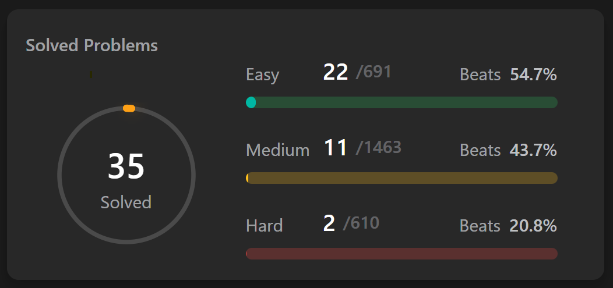

## About me

<table>
    <tr>
        <td>Name</td>
        <td>Nikita</td>
    </tr>
    <tr>
        <td>Surname</td>
        <td>Tolstik</td>
    </tr>
    <tr>
        <td>Birthday</td>
        <td>27th May 2001</td>
    </tr>
    <tr>
        <td>Position</td>
        <td>React Front-end Developer</td>
    </tr>
    <tr>
        <td>English Level</td>
        <td>Intermediate</td>
    </tr>
    <tr>
        <td>Programming Experience</td>
        <td>since August 2016</td>
    </tr>
    <tr>
        <td>Commercial Experience</td>
        <td>since August 2019</td>
    </tr>
    <tr>
        <td>Interests</td>
        <td>Investing, Business, Programming, Crypto</td>
    </tr>
    <tr>
        <td>Hobbies</td>
        <td>Reading, Play Games, Drive a car</td>
    </tr>
    <tr>
        <td>Favorite Phrase</td>
        <td>There's a time for everything</td>
    </tr>
</table>

## Roadmap.sh

## LeetCode

## How to reach me

  

